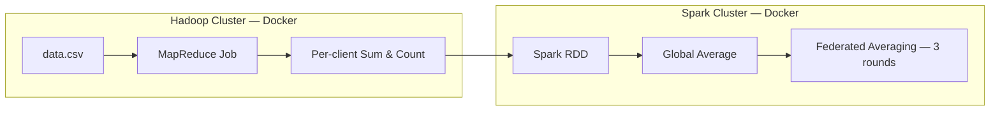

# MapReduce, Hadoop & Spark for Federated Learning

A hands-on exploration of distributed data processing (Hadoop MapReduce, Apache Spark) applied to a Federated Learning aggregation scenario — built with Docker, Java, and PySpark.

## Overview

This project implements a two-stage distributed pipeline that mirrors the core idea of Federated Learning: aggregating statistics from multiple clients without ever centralizing their raw data.

1. **Hadoop MapReduce** aggregates per-client statistics (sum and count of a feature) from a CSV dataset, simulating the "local aggregation" step a real FL system would run on each client's data.
2. **Apache Spark** consumes those per-client aggregates, computes a global average, and simulates several rounds of *federated averaging* — the core algorithm behind systems like Google's Federated Learning.

Both stages run on their own Dockerized cluster (Hadoop and Spark respectively), reflecting how these systems are actually deployed in practice.

## Architecture



## Tech Stack

| Layer | Technology |
|---|---|
| Distributed storage | HDFS |
| Resource management | YARN |
| Batch processing | Hadoop MapReduce (Java) |
| In-memory distributed processing | Apache Spark (PySpark) |
| Orchestration | Docker & Docker Compose |

## Project Structure

```
.
├── part1_foundations/       # Core concepts: MapReduce, Hadoop, Spark
├── part2_comparison/        # Spark vs. Hadoop comparative analysis
├── part3_federated_learning/
│   ├── task1_hadoop/        # MapReduce job: per-client aggregation
│   ├── task2_spark/         # Federated averaging simulation
│   └── task3_analysis/      # Performance analysis & related work
└── docker/
    ├── hadoop/              # Hadoop cluster (docker-compose)
    └── spark/               # Spark cluster (docker-compose)
```

## Results

Running the pipeline on the provided dataset (3 clients, 172 records) produced:

| Client | Sum | Count |
|---|---|---|
| client1 | 2197.60 | 58 |
| client2 | 2381.80 | 57 |
| client3 | 2568.60 | 57 |

**Federated averaging simulation (Spark):**

| Round | Global Average |
|---|---|
| Initial | 41.56 |
| Round 1 | 41.78 |
| Round 2 | 42.11 |
| Round 3 | 40.96 |

## Running It

```bash
# 1. Start the Hadoop cluster
cd docker/hadoop && docker compose up -d

# 2. Compile and run the MapReduce job (see part3_federated_learning/task1_hadoop/)

# 3. Start the Spark cluster
cd docker/spark && docker compose up -d

# 4. Run the federated averaging job (see part3_federated_learning/task2_spark/)
```

Detailed steps, code, and execution screenshots are documented in each task's own README.

## Author

Taha Abolhasani
