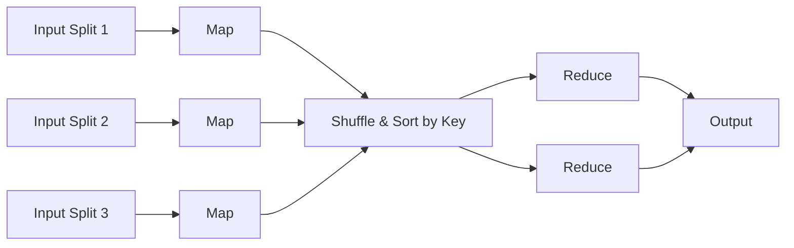
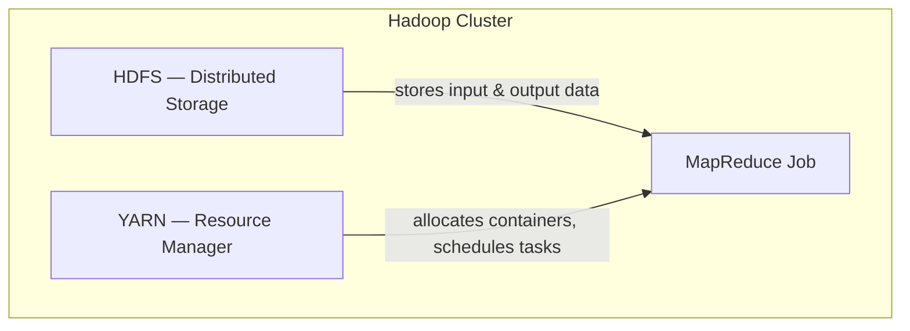

# Part 1 — Foundational Knowledge & Environment Setup

This section introduces the core distributed-computing concepts used throughout this project — MapReduce, Hadoop, and Apache Spark — and explains how they relate to each other architecturally.

## 1. MapReduce

MapReduce is a programming model for processing large datasets in parallel across a cluster of machines. Instead of moving data to a central processor, MapReduce moves the *computation* to where the data lives, which is what allows it to scale to very large datasets. A MapReduce job is broken into three phases:

- **Map phase** — Each input record is processed independently and transformed into a set of intermediate `(key, value)` pairs. Because records are handled independently, this phase parallelizes trivially across many machines.
- **Shuffle phase** — The framework groups all intermediate values that share the same key and transfers them to the machine that will reduce that key. This is the only phase that requires network communication between nodes, and it is usually the most expensive part of a MapReduce job.
- **Reduce phase** — For each key, a reducer receives the full list of values produced by all mappers for that key and aggregates them into a final result (e.g., a sum, a count, an average).

In this project, Task 1 implements exactly this pattern: the Mapper emits `(client_id, feature_value,1)`, the shuffle groups these by `client_id`, and the Reducer sums the feature values and counts per client.

## 2. Hadoop

Apache Hadoop is an open-source framework for reliable, distributed storage and processing of large datasets across clusters of commodity hardware. It is built from three core modules:

- **HDFS (Hadoop Distributed File System)** — A distributed storage layer that splits files into blocks and replicates them across multiple machines (DataNodes), coordinated by a NameNode that tracks where each block lives. This gives Hadoop fault tolerance: if a machine fails, the data is still available on other nodes.
- **YARN (Yet Another Resource Negotiator)** — The cluster's resource manager. It decides which machines run which tasks and monitors their execution, decoupling resource management from the processing logic itself.
- **MapReduce** — The processing engine described above, which runs *on top of* HDFS and YARN.

### Architectural relationship between Hadoop and MapReduce

MapReduce is not a standalone system — it depends entirely on the infrastructure Hadoop provides:

Concretely: HDFS stores the input dataset (split into blocks across DataNodes) and later the job's output. YARN is responsible for launching the Map and Reduce tasks on the cluster nodes and tracking their progress. MapReduce itself only defines *what* computation to run (the map and reduce logic); it relies on YARN for *where* to run it and on HDFS for *where the data lives*. This separation is what allows Hadoop to scale a job from a single machine to thousands of nodes without changing the MapReduce code.

## 3. Apache Spark

Apache Spark is a distributed data-processing engine designed to be significantly faster than classic MapReduce, primarily because it keeps intermediate data in memory rather than writing it to disk between stages. Spark exposes two main data abstractions:

- **RDD (Resilient Distributed Dataset)** — An immutable, partitioned collection of objects distributed across a cluster, on which operations like `map`, `filter`, and `reduce` can be applied in parallel. RDDs track the sequence of transformations used to build them (their "lineage"), which allows Spark to recompute lost data after a failure without needing full replication.
- **DataFrame** — A higher-level, tabular abstraction (conceptually similar to a table in a relational database or a pandas DataFrame) built on top of RDDs. DataFrames let Spark's query optimizer (Catalyst) analyze and optimize operations before executing them, which is why DataFrame code is often faster than equivalent raw RDD code.

Spark also natively supports iterative workloads — repeatedly processing the same dataset in a loop — which classic MapReduce handles poorly because each iteration requires a full read/write cycle to disk. This property is directly relevant to this project: Task 2 uses Spark's RDD API to run multiple rounds of federated averaging over the same in-memory dataset.

## Environment Setup

Hadoop and Spark were deployed locally using Docker Compose rather than a native install, to avoid the setup and dependency issues a local install would introduce. Two independent clusters were used:

| Component | Image | Services |
|---|---|---|
| Hadoop | `gelog/hadoop` | NameNode, DataNode, Secondary NameNode, YARN |
| Spark  | `bde2020/spark-master` / `bde2020/spark-worker` | Spark Master, 1 Spark Worker |

Both clusters expose their web UIs for job monitoring:
- HDFS NameNode UI — `http://localhost:50070`
- YARN Resource Manager UI — `http://localhost:8088`
- Spark Master UI — `http://localhost:8080`

Setup and execution screenshots for both clusters are available in `part3_federated_learning/task1_hadoop/screenshots/` and `part3_federated_learning/task2_spark/screenshots/`.
